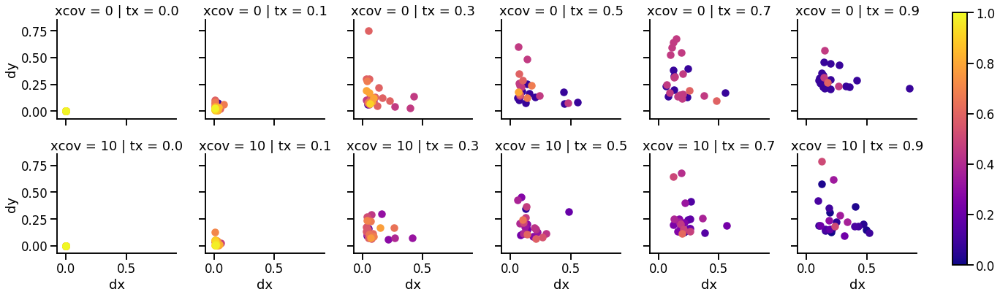

# Update meeting 2019-02-05

---

## Admin

- [X] send out [when2meet.com](https://www.when2meet.com/?7494790-vocb8) for committee meeting
  - 4/5 members avail Mar 20, 21, Apr 11

- [X] Fill out [VISTA travel grant application](http://vista.info.yorku.ca/opportunities/visiting-scholar-trainee-awards/) mid feb

---
### sleep_predictor

- Project scope
- Data
- [Code](https://github.com/jzlab/sleep_ann)
  - Github account for student?
  - Other things?

---

### Vision Autoencoder

+++

- #### How important is forcing orthoganality via XCov?

- [ ] embed identity into word2vec instead of oh_vec
  - [Label-Embedding for Image Classification](https://arxiv.org/pdf/1503.08677.pdf)
  - [Image classification w/ Fisher Vector](https://hal.inria.fr/hal-00830491v2/document)
---

